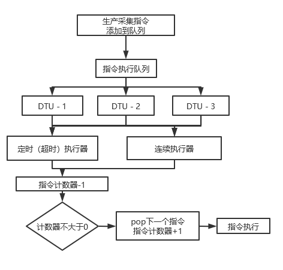

本项目是个半成品，只为开源技术交流

适合阅读过JetLinks源码并开发过相应组件的朋友

如果非此类人员，在此劝退，本人才疏学浅没办法手把手教学，

特别欢迎技术交流，非常期待技术指导

此次提交了influxdb2.0组件和modbus协议，粗糙至极，抛砖引玉而已

modbus相关的配置 已经把h2数据库推上了，请连接数据库查看

## 正经事儿`1

### influxdb2.0模块

功能实现

- influxdb的写入，各种方式的写入，具体参看代码
- influxdb的查询，分页、count就这俩别的没了
- 不过提供了一个自定义influxdb的Flux语法查询，需要一定的2.0语法功底

通过修改存储策略配置可实现将日志存入influxdb2.0的数据库中

> 放心，我已经把默认改成influxdb2.0了

### modbus协议

依托于DTU透传协议的modbus协议支持

1. 先看modbus-manager中的实体类
    1. ProductCollectConfig配置产品采集策略
    2. DeviceCollectConfig配置设备采集策略，为空的项默认使用产品配置
    3. ModbusProductModel配置modbus子设备的指标信息，通过这个拼装modbus指令
2. 再看`org.jetlinks.community.modbus.task.Task`
    1. 这个启动加载的类是为了把数据同步到jvm中，方便协议包调用
    2. 用了枚举单例和线程安全的数据结构
    3. 采集周期的粒度以分为单位
    4. 采集指令分两部分
        1. Task类中的定时（超时）触发 单位时间内触发有限次【参考擒纵机】
        2. 协议中的连续触发（后续会详细讲）
    5. 指令生成器
        1. 严格意义上来讲，指令生成器才是控制读取设备指标的
        2. 定时器按照采集策略定时生成指令丢到队列（看代码）
    6. 定时（超时）执行器
        1. 执行器每隔一段时间执行一次，没有任何条件能阻止他
        2. 队列有待发命令他就把命令发给设备
        3. 为什么起这个名字
            1. 他其实就是一个定时器
            2. 队列因为他而动起来（必定消费第一条指令）
            3. 只不过他执行的大部分都是因为上一条指令超时没收到回复而中断的后续指令队列
            4. 仔细品品上句话
            5. 这个执行器的目的就是为了启动队列执行，and 防止队列因为指令超时而停摆
            6. 如果看的不明白就需要看一下modbus协议中的连续执行器
3. modbus协议
    1. 参考官方demo
    2. 内容包括
        1. 注册认证
        2. 心跳处理
        3. 子设备消息解析 附带连续执行器

详细说一下两个执行器

1. 定时执行器
    1. 主要作用就是消费队列里面的指令
    2. 指令是按照采集策略按需生成的，所以超时时间一定要小于采集频率
    3. 当某个DTU下的子设备超时过多时会产生消息积压，请自行处理
2. 连续执行器
    1. 收到指令回复之后继续pop下个指令，正常消费队列

一张简陋的示意图
